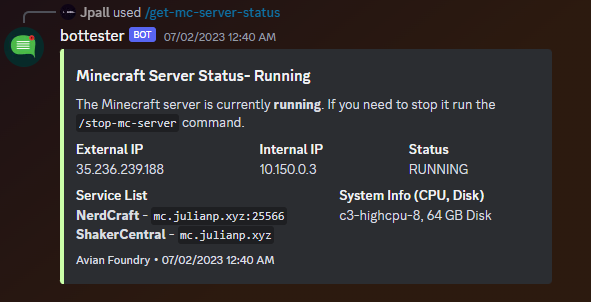
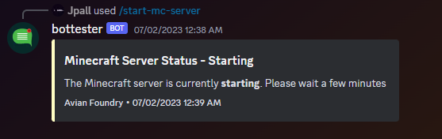
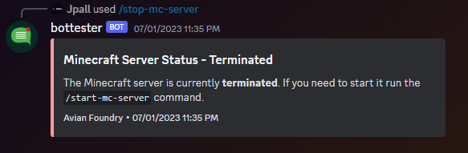

# About

This is a simple project that I built for my friends and I to play minecraft together. It's a Discord bot that allows you to interface with a Google Cloud VM instance that is running a minecraft server. 

The code base is a little hacky, but it works. I'm not a professional developer, so I'm sure there are a lot of things that could be done better. I'm open to suggestions and pull requests.

# Setup

This project is built for use with Node.js version `19.6.0` but should function with most versions of Node.js. 

Currently the codebase is **not** ready to be deployed. There are a few things that need to be done first. 

1. Instance names, zone, and projectID are hard coded into the various `mc-*.js` files. You'll need to change these to match your instance names. 
    - The footer of all of the embeds is also hard coded. You'll need to change this to match your instance name as well.

    - On line 45 of `mc-status.js` you'll need to change the value of the service list to match the services you have running on your instance. The field can also be removed if you don't want to display the status of a service.

1. You will need to create a `config.json` which will contain all of your sensitive tokens. Use the `example.config.json` file as a template.

1. Rename `example.settings.json` to `settings.json`. 
    - The values in this file are used to configure the colors used within the embeds. You can change these to whatever you want or use the default values.

1. Install all of the dependencies with `npm install`

1. Run the bot with `node prod.js`

# Commands

The bot has a few commands that you can use to interact with the server. All of the commands have safeguards in place to prevent issuing a command that would cause the server to be in an invalid state.

- `/mc-status` - This command will display the status of the server and any services that are running on the instance. Also gives some basic information about the instance.

- `/mc-start` - This command will start the instance if it is not already running.

- `/mc-stop` - This command will stop the instance if it is running. requires confirmation.

